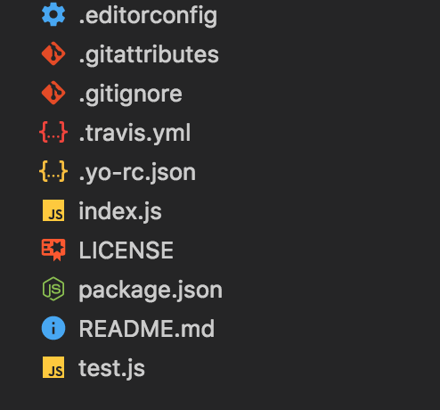

<div align="center">
  
</div>
<br>
<div align="center">
  <strong>Scaffold out a modest node module</strong>
</div>
<br>
<div align="center">
    <a href="https://github.com/feross/standard">
      
    </a>
    <a href="https://travis-ci.org/tiaanduplessis/generator-dup">
      
    </a>
    <a href="https://github.com/RichardLitt/standard-readme)">
      
    </a>
    <a href="https://badge.fury.io/gh/tiaanduplessis%2Fgenerator-dup">
      
   </a>
     <a href="https://dependencyci.com/github/tiaanduplessis/generator-dup">
    
  </a>
  <a href="https://github.com/tiaanduplessis/generator-dup/blob/master/other/LICENSE">
    
  </a>
  <a href="http://makeapullrequest.com">
    
  </a>
  <a href="https://www.paypal.me/tiaanduplessis/1">
    
  </a>
</div>
<br>
<div align="center">
  <a href="https://github.com/tiaanduplessis/generator-dup/watchers">
    
  </a>
  <a href="https://github.com/tiaanduplessis/generator-dup/stargazers">
    
  </a>
  <a href="https://twitter.com/intent/tweet?text=Check%20out%20generator-dup!%20https://github.com/tiaanduplessis/generator-dup%20%F0%9F%91%8D">
    
  </a>
</div>
<br>
<div align="center">
  Built with ❤︎ by <a href="http://tiaanduplessis.co.za">Tiaan</a> and <a href="https://github.com/tiaanduplessis/generator-dup/graphs/contributors">contributors</a>
</div>

<h2>Table of Contents</h2>
<details>
  <summary>Table of Contents</summary>
  <li><a href="#introduction">Introduction</a></li>
  <li><a href="#install">Install</a></li>
  <li><a href="#usage">Usage</a></li>
  <li><a href="#contribute">Contribute</a></li>
  <li><a href="#license">License</a></li>
</details>

## Introduction

This is a generator I use for my modules. It uses [JavaScript Standard Style](https://github.com/feross/standard) for linting, [Jest](https://facebook.github.io/jest/) as a test platform and [Husky](https://github.com/typicode/husky) for easy Git Hooks.

## Install

Make sure `yeoman` is installed:

```sh
$ npm install -g yo
```

Then install the generator

```sh
$ npm install -g generator-dup
```

## Usage

With [yo](https://github.com/yeoman/yo):

```sh
$ yo dup
```

This will scaffold out:

<div align="center">
  
</div>


## Contribute

PRs accepted.

## License

Licensed under the MIT License.

Icon made by <a href="http://www.flaticon.com/authors/gregor-cresnar" title="Gregor Cresnar">Gregor Cresnar</a> from <a href="http://www.flaticon.com" title="Flaticon">www.flaticon.com</a> is licensed by <a href="http://creativecommons.org/licenses/by/3.0/" title="Creative Commons BY 3.0" target="_blank">CC 3.0 BY</a>
