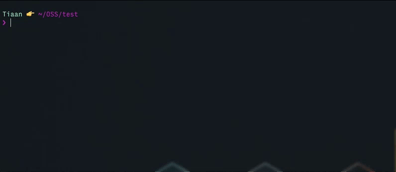

# generator-dup

 




[](https://github.com/feross/standard)
[](https://github.com/RichardLitt/standard-readme)
[](https://travis-ci.org/tiaanduplessis/generator-dup)

> Scaffold out a modest node module

This is the generator I use for my modules. It uses [JavaScript Standard Style](https://github.com/feross/standard) for linting, [Mocha](http://mochajs.org/) as a test framework and [Chai](http://chaijs.com/) as a assertion library.
The [chokidar cli](https://github.com/kimmobrunfeldt/chokidar-cli) is used to watch for changes.

## Table of Contents

- [Install](#install)
- [Usage](#usage)
- [Contribute](#contribute)
- [License](#license)

## Install

```sh
$ npm install --global yo generator-dup
```

## Usage

With [yo](https://github.com/yeoman/yo):

```sh
$ yo dup
```

## Contribute

PRs accepted.

Small note: If editing the README, please conform to the [standard-readme](https://github.com/RichardLitt/standard-readme) specification.

## License

Created with ♥ by [Tiaan du Plessis](http://tiaanduplessis.co.za/). Licensed under the MIT License.
