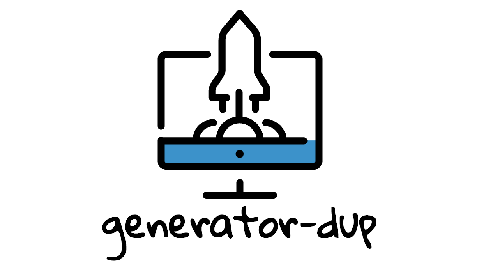

<div align="center">
  
</div>
<br>
<div align="center">
  <strong>Scaffold out a modest node module</strong>
</div>
<br>
<div align="center">
    <a href="https://github.com/feross/standard">
      
    </a>
    <a href="https://travis-ci.org/tiaanduplessis/generator-dup">
      
    </a>
    <a href="https://github.com/RichardLitt/standard-readme)">
      
    </a>
    <a href="https://badge.fury.io/gh/tiaanduplessis%2Fgenerator-dup">
      
   </a>
   <a href="https://greenkeeper.io/">
      
   </a>
</div>
<br>
<div align="center">
  Built with ❤︎ by <a href="http://tiaanduplessis.co.za">Tiaan du Plessis</a>
</div>

<h2>Table of Contents</h2>
<details>
  <summary>Table of Contents</summary>
  <li><a href="#introduction">Introduction</a></li>
  <li><a href="#install">Install</a></li>
  <li><a href="#usage">Usage</a></li>
  <li><a href="#oss">OSS</a></li>
  <li><a href="#contribute">Contribute</a></li>
  <li><a href="#license">License</a></li>
</details>

## Introduction

This is a generator I use for my modules. It uses [JavaScript Standard Style](https://github.com/feross/standard) for linting, [Mocha](http://mochajs.org/) as a test framework and [Chai](http://chaijs.com/) as a assertion library.

## Install

```sh
$ npm install --g yo generator-dup
```

## Usage

<div align="center">
  
</div>

With [yo](https://github.com/yeoman/yo):

```sh
$ yo dup
```

## Contribute

PRs accepted.

## License

Licensed under the MIT License.

Icon made by <a href="http://www.flaticon.com/authors/gregor-cresnar" title="Gregor Cresnar">Gregor Cresnar</a> from <a href="http://www.flaticon.com" title="Flaticon">www.flaticon.com</a> is licensed by <a href="http://creativecommons.org/licenses/by/3.0/" title="Creative Commons BY 3.0" target="_blank">CC 3.0 BY</a>
